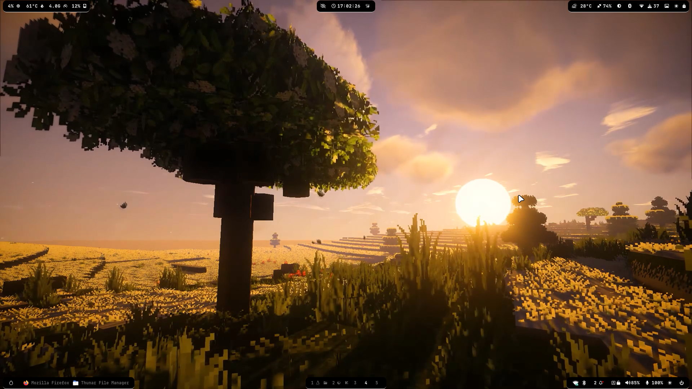
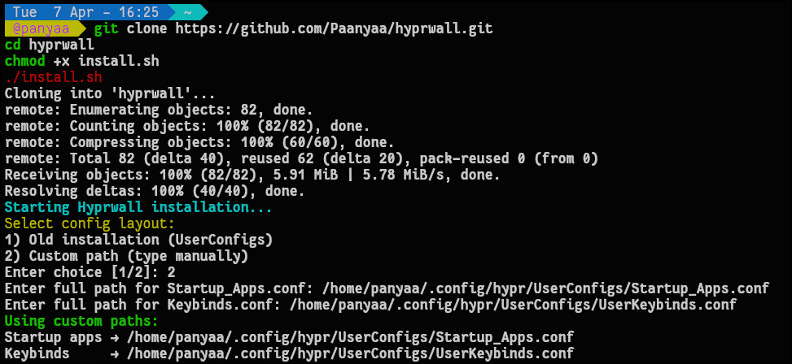
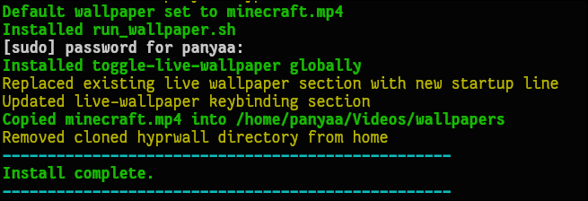
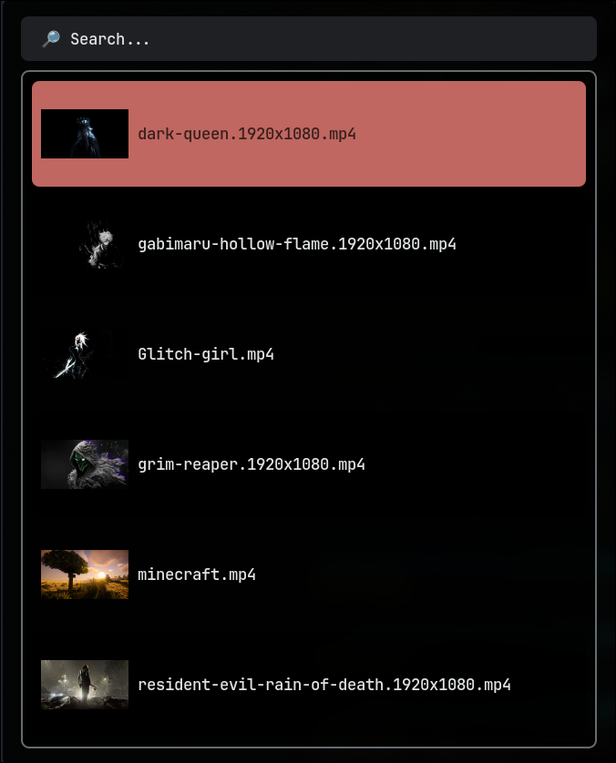
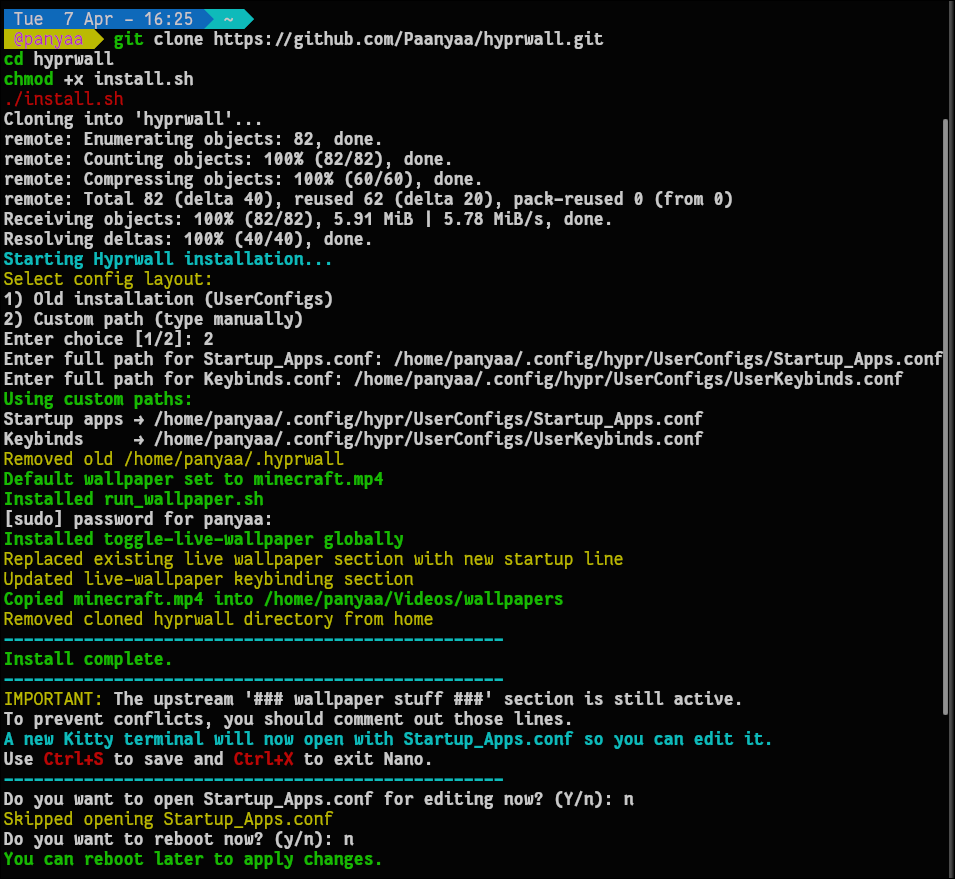
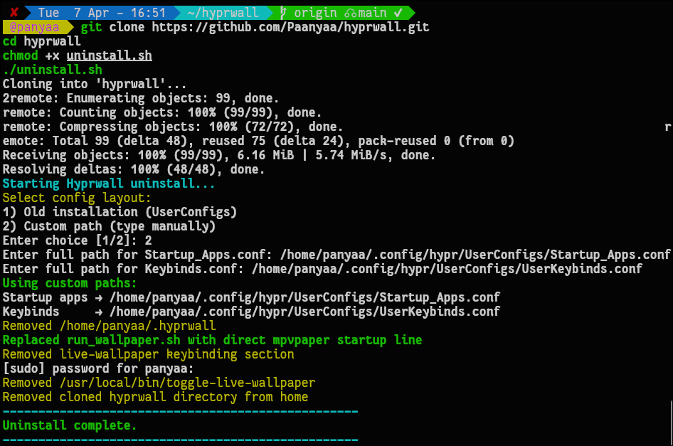
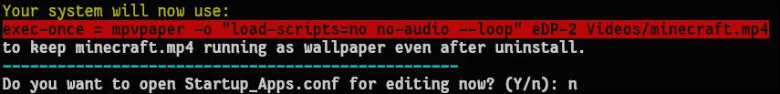
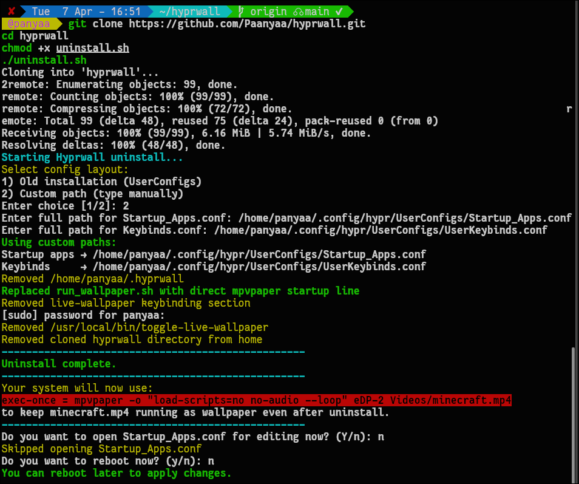

 *This is custom basic live wallpaper manager for* **Hyprland** *only*.
*Default key binding for hyprwall is SHIFT + SUPER + W. It can we used for both stopping and restarting live wallpaper.*



## What is **hyprwall** ?
Its a custom basic live wallpaper manager I made which helps us:
- Automatically start wallpaper
- Toggel wallpapers with key bindings
- Manage performace by stopping wallpaper when instructed
- Can we easily installed and uninstalled anywhere.

## Steps :
1. Clone the repo and use install.sh script to install.
```bash
git clone https://github.com/Paanyaa/hyprwall.git
cd hyprwall
chmod +x install.sh
./install.sh
```

2. Now script will ask weather your Hyprland is old or new(new one has 2 different config files for Startup Apps and KeyBindings). *Old user can directly skip to step 4*.
If u have new hyprland **[ *SHIFT + SUPER + E* ]** to open **Hyprland Settings**.



3. *( only for new hyprland users)*Now copy paste Default Startup Apps and Keybinding pathon terminal and press *ENTER*.

4. Now enter sudo password, it will add **toggle-live-wallpaper** to your */usr/local/bin* and keybinding for it as **[ *CTRL SUPER W* ]** which will let you to change wallpaper.



After pressing **[ *CTRL SUPER W* ]** will show all live wallpaper present in *~/Videos/wallpapers*.


**Note :** Only for new hyprland users you need to manually uncomment all the startup commands in \### Wallpaper Stuff \###.
Press *ENTER* and it will open Startup Apps file in nano which u mentioned while installation.

5. Reboot to apply changes in Startup Apps.



## Steps for uninstall :
6. Clone the repo and use uninstall.sh script.
```bash
git clone https://github.com/Paanyaa/hyprwall.git
cd hyprwall
chmod +x uninstall.sh
./uninstall.sh
```

7. Select your config layout old and new.
For new config layout you need to mention paths as done in **STEP 2** and enter password.


8. Now *exec-once = mpvpaper -o "load-scripts=no no-audio --loop" eDP-2 Videos/minecraft.mp4* will be set as ur deafult for live wallpaper u can comment it by pressing *ENTER*.


9. Reboot to make changes.



